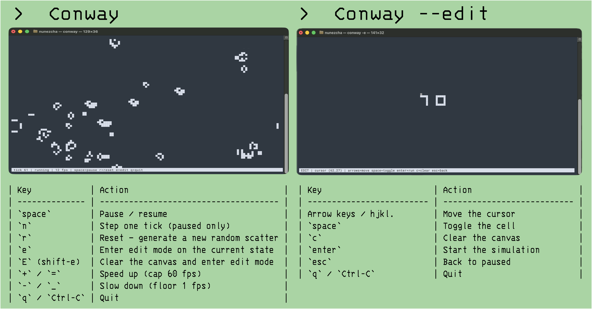

# CONWAY
Complexity arises from simplicity in your terminal. Launches into a populated ecosystem by default, or drops you onto a blank canvas where you place your own live cells and watch them evolve. This is a Rust port of a math script. It now has a real input loop, toroidal edges, a diff-based renderer, and twice the vertical resolution per terminal row as the original script.



## Features

- **Auto-ecosystem** — on launch, the canvas fills with a weighted random scatter of well-known patterns (gliders, spaceships, oscillators, the Gosper glider gun, still lifes) and they immediately start interacting.
- **Edit mode** — place your own cells on a blank canvas, then watch the simulation unfold. Enter via `conway --edit` or by pressing `e` at any time during a running simulation.
- **Toroidal grid** — the canvas wraps at every edge, so gliders fly forever instead of dying at the wall.
- **Half-block rendering** — uses the Unicode upper/lower half-block to pack two simulation cells into one terminal character, so cells look approximately square and you get twice the rows. The other option is to use braille, but those blocks are somewhat illegible in my opinion. 
- **Diff renderer** — only the character positions that actually changed are written each frame.
- **Resize-aware** — you can drag your terminal window around; the canvas reflows on the fly.
- **Panic-safe** — a `Drop` guard plus a panic hook always restore your terminal (alt-screen off, raw mode off, cursor visible) on exit or crash.

## Install

From the repo root:

```sh
cd conway
cargo install --path .
```

That puts a `conway` binary on your `PATH`.

To run without installing:

```sh
cargo run --release
```

Requires a recent stable Rust toolchain (1.70+).

## Usage

```sh
conway              # auto-scatter ecosystem at 12 ticks/sec
conway --edit       # blank canvas, cursor at center
conway -e           # same as --edit
conway --fps 20     # custom tick rate (1..=60)
conway --help       # show all flags
```

## Controls

### Running / Paused mode

| Key            | Action                                |
| -------------- | ------------------------------------- |
| `space`        | Pause / resume                        |
| `n`            | Step one tick (paused only)           |
| `r`            | Reset — generate a new random scatter |
| `e`            | Enter edit mode on the current state  |
| `E` (shift-e)  | Clear the canvas and enter edit mode  |
| `+` / `=`      | Speed up (cap 60 fps)                 |
| `-` / `_`      | Slow down (floor 1 fps)               |
| `q` / `Ctrl-C` | Quit                                  |

### Edit mode

| Key                       | Action                                 |
| ------------------------- | -------------------------------------- |
| Arrow keys / `h` `j` `k` `l` | Move the cursor                     |
| `space`                   | Toggle the cell under the cursor       |
| `c`                       | Clear the canvas                       |
| `enter`                   | Exit edit mode and start the simulation|
| `esc`                     | Exit edit mode back to paused          |
| `q` / `Ctrl-C`            | Quit                                   |

Cursor coordinates are shown in the status bar. The cursor moves one half-cell at a time vertically — two presses of `j` advance one terminal row.

## Pattern catalog

The startup scatter picks from these, weighted toward visually active forms:

- **Still lifes**: block, beehive, loaf, boat, tub
- **Oscillators**: blinker, toad, beacon, pulsar
- **Spaceships**: glider, LWSS, MWSS, HWSS
- **Guns**: Gosper glider gun

Patterns are stored as multi-line ASCII art literals in [src/patterns.rs](src/patterns.rs) and parsed once on startup. This makes it pretty easy to extend by just adding another `parse(...)` call to the catalog.

## How it works

```
src/
├── main.rs      — clap CLI, terminal lifecycle, panic hook
├── app.rs       — App struct, run loop, mode state machine
├── grid.rs      — double-buffered Vec<u8>, toroidal B3/S23 tick
├── patterns.rs  — pattern catalog + weighted scatter generator
├── render.rs    — half-block diff renderer + status bar
└── input.rs     — key event handling for both modes
```

So math is pretty well characterized by the original work, but it is instantiated here with some rust specific language. The grid is a flat `Vec<u8>` of length `w * h` with a parallel `back` buffer; each tick writes into `back` then swaps. Neighbor indexing wraps via precomputed `(x ± 1 mod w, y ± 1 mod h)`. The renderer keeps `prev` and `next` half-block frames and only emits `MoveTo` + glyph for the positions where they differ; one `flush()` per frame.

The main loop is a single `event::poll(timeout)` where `timeout = 1000ms / fps`. If an event fires within the window we handle it; otherwise we advance one tick (only in `Running` mode). Either way we re-render and loop.

## Dependencies

- [`crossterm`](https://docs.rs/crossterm) — terminal I/O, raw mode, alt-screen, key & resize events
- [`clap`](https://docs.rs/clap) — argument parsing
- [`rand`](https://docs.rs/rand) — pattern placement

I started with `ratatui` since that is what I have used for other rust UI's, but since this is a single full-screen canvas, raw `crossterm` is leaner and gives full control over the diff renderer.

## License

The bash reference (`../conway.sh`) is MIT-licensed by Andrew McCluskey. Although very little of that codebase remains, this Rust port is offered under the same terms.
